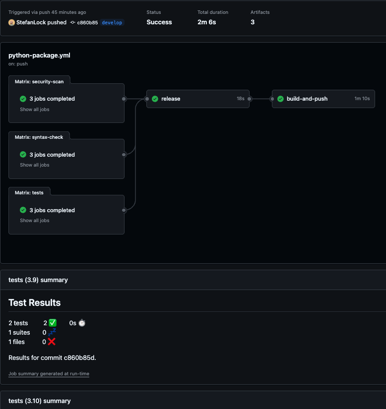

# Python-build-pipeline

## Description

This is a build pipeline template I use for my python projects. It demonstrates the multiple stages often needed in the build process today and utilises automation to help follow best practices when building applications.

> _Note:_ This is part one as I will look to add another repo demonstrating GitOps deployments.

---

### Pipeline breakdown
I always include these areas in my pipelines to help development.

#### Security
> We run security scans continuosly to ensure we capture issues quickly in the development process.

#### Linting
> We have all been there with those little syntax errors. Scanning for this early ensures we capture those errors quickly and get them fixed.

#### Test
> We run tests against our code, mostly unit tests at this stage. This just allows us to capture any issues quickly and ensure the code does what we expect.

#### Release
> We use the plugin [semantic-release](https://semantic-release.gitbook.io/semantic-release) which does a few things:
> * Updates the ChangeLog
> * Create a release
> * Creates a tag
>
> This way we can automate the versioning using rules within our commit. You can find these in the documentation.

#### Build and Push
> To finish the pipeline we push our newly built image to our GitHub registry with the correct tag.

---

### Screenshot

### Running the application

* docker build -t flask-demo:latest .
* docker run flask-demo:latest -p 5000:5000

---

### Next steps
The next part is to create the deployment pipeline which extends this application and deploying it to and ECS cluster. That will complete the entire workflow.